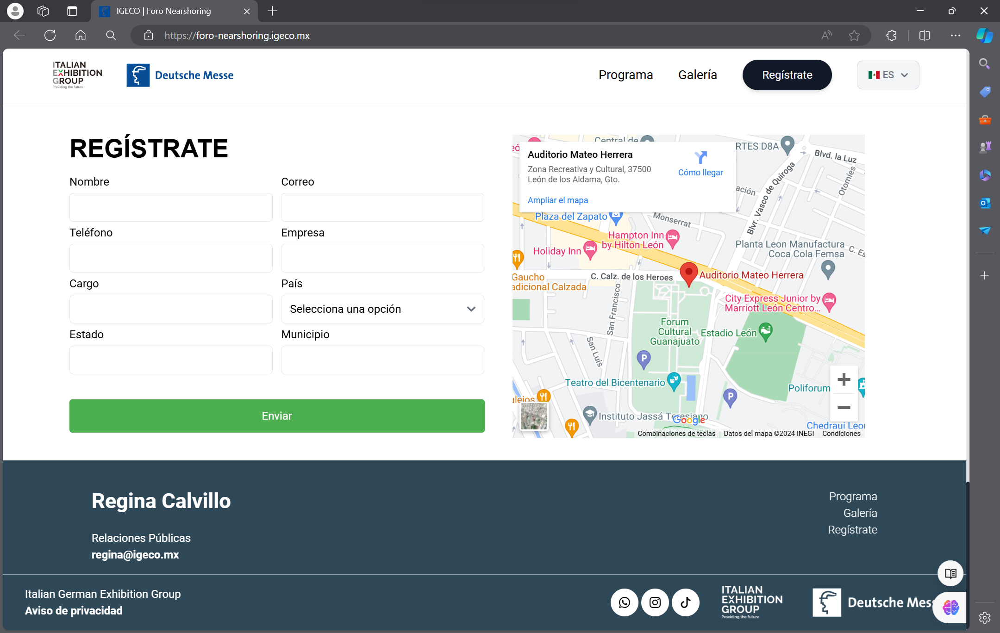

# Foro Electromovilidad 2024

 

This project features a Landing Page designed for the "Foro Electromovilidad 2024", a conference dedicated to exploring the latest trends, innovations, and developments in electromobility. The page is built using Astro for the frontend and Express for the backend, ensuring a smooth and efficient experience for both users and event administrators.

## 🖼️ Project Screenshots:

## 🕹️ Commands

These commands are executed from the root of the project and are used for the frontend:

| Command                   | Action                                           |
| :------------------------ | :----------------------------------------------- |
| `npm install`             | Installs dependencies                            |
| `npm run dev`             | Starts local dev server at `localhost:4321`      |
| `npm run build`           | Build your production site to `./dist/`          |
| `npm run preview`         | Preview your build locally, before deploying     |

These commands are executed from the /server folder and are used for the backend:

| Command                   | Action                                           |
| :------------------------ | :----------------------------------------------- |
| `npm install`             | Installs dependencies                            |
| `npm run dev`             | Starts local dev server at `localhost:3000`      |
| `npm run start`           | Starts production server at `localhost:3000`     |
  
## 💻 Built with

Technologies used in the project:

*   Node.js
*   Astro
*   React
*   Express
*   Tailwind CSS
*   MySQL
